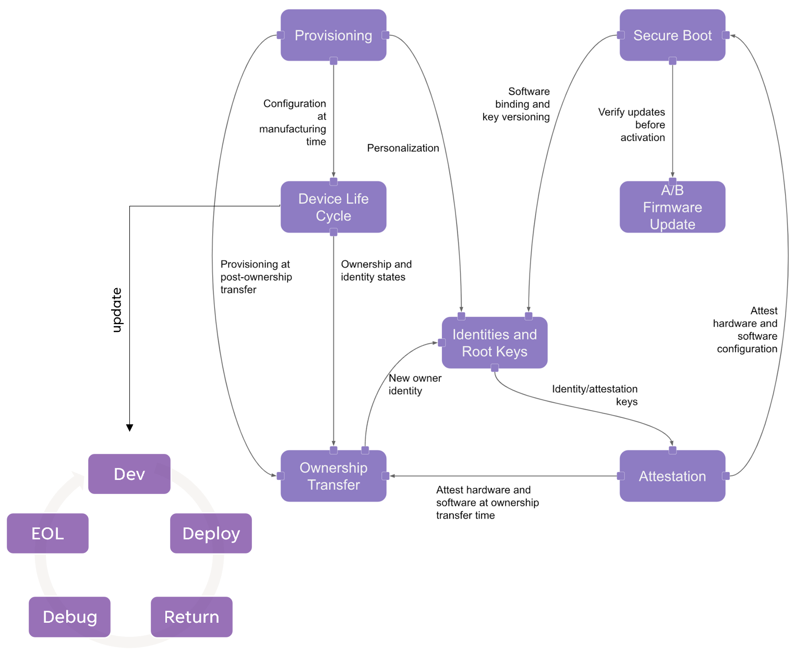
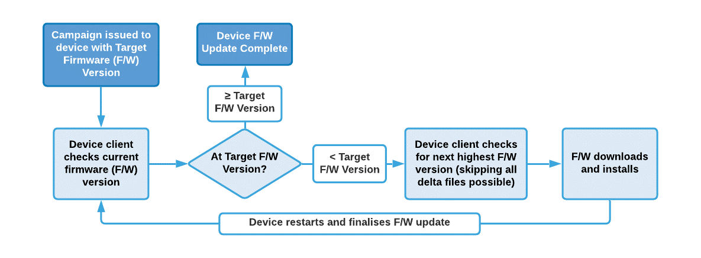

= RISC-V Platform Security Model
:toc: macro

Version 0.5

**__This is a proposal prepared by RISC-V members. This document shall define the RISC-V Platform Security Model by analyzing security concerns, threat models, and deriving security requirements, paving the way for a security model with two guiding principles - 1) Zero Trust__** **__[1][2]__** **__and 2) Intrinsic Security for all kinds of RISC-V platforms/ product profiles.__**

TABLE OF CONTENTS

toc::[]

. Overview

Security needs to be an intrinsic part of the hardware, software, and firmware and no longer an afterthought or add-on feature. This document provides a holistic view of the threat model, security analysis, security requirements/ recommendations enabling anyone building a RISC-V platform. 
:toc: macro

  .. Guiding Principles
    ... Intrinsic Security

Security has often been a late consideration in the development of systems, hardware, and software. The emergence of exploits such as malware, trojans, the recent Spectre, Meltdown, RAMbleed attacks has resulted in serious financial and reputational losses. This illustrates the need to consider security as an essential component, directly built into a system rather than layered on top. 

Unlike other commercial architectures such as X86 and ARM which carry a lot of legacies, RISC-V is a clean slate architecture that can invite a whole lot of new features and solutions both in hardware and software. Below are some key rationale for improving and accelerating RISC-V security

* Clean slate architecture with no legacy support complexity
* Open security model accelerates hardware security innovation
* Opportunity to incorporate industry learnings & best practices for security
* Open governance facilitates collaboration on the best security approach
* Royalty-free model enables wide access to new hardware security solutions thereby democratizing innovation.
    ... Zero Trust

The Zero Trust model follows the principle "never trust, always verify." The term Zero Trust does not mean "Zero" Trust, but it's quite the opposite. It improves the trust of the whole platform by not having any implicit trust assumptions among various components that are interconnected, but by establishing trust verifying/ authenticating before trusting.

For further details please refer to #heading=h.4lph2pn2tziw[Chapter 2].

  .. Device Model

This diagram below represents a generic device model having an application processor, other IPs, etc. on the left side and root-of-trust on the right side that is isolated from each other. The only communication between the two domains is via a security mailbox.

image:img_0.png[]

_Figure 1: Device Model_

The root-of-trust consists of the following elements:

. An immutable code and data that are typically programmed into ROM/ OTP and root-keys either provisioned into OTP or generated every time from the PUF (physical unclonable function) hardware
. A mutable code and data that are updated onto the flash to fix bugs or enhance features, which are authenticated and verified before consumption
. A secure storage mechanism to store secrets/ assets bound to the platform, ex: root-key
. A secure mailbox is the only mechanism to communicate between both the domains

  .. Security Goals

The security goals are high-level essential security features for a platform to implement, for the product to be secure and trustworthy. Note that depending on the final usecase, some or all of these goals may not be required and that this will be defined in the mapping to platform specifications (TBD - point to the mapping section later).

|===
| #                                                                                                                                                                                                               | Goal                                                                                                                                                                                                            | Description                                                                                                                                                                                                      
| 1                                                                                                                                                                                                               | A platform is uniquely identifiable                                                                                                                                                                             | A platform shall have an immutable identity that is both verifiable and attestable                                                                                                                               
| 2                                                                                                                                                                                                               | A platform shall only execute authorized software                                                                                                                                                               | A platform shall verify and authenticate any software before execution                                                                                                                                           
| 3                                                                                                                                                                                                               | A platform shall support device bound storage                                                                                                                                                                   | A platform shall support a secure storage mechanism to store keys/ secrets that are tied to a particular platform (confidentiality & integrity protection of secret keys, integrity protection for public keys)  
| 4                                                                                                                                                                                                               | A platform shall support secure TCB update                                                                                                                                                                      | A platform shall verify and authenticate any software image updates before loading/ storing/ executing them                                                                                                      
| 5                                                                                                                                                                                                               | A platform shall prevent software version rollback                                                                                                                                                              | A platform shall prevent software version rollback with anti-rollback mechanism using techniques like monotonous counters                                                                                        
| 6                                                                                                                                                                                                               | A platform shall support security through its lifecycle                                                                                                                                                         | A platform shall support security through various lifecycle stages such as development, deployed, returned, end-of-life, etc                                                                                     
| 7                                                                                                                                                                                                               | A platform shall support isolation for code & data                                                                                                                                                              | A platform shall support both temporal and spatial isolation for security sensitive code and data                                                                                                                
| 8                                                                                                                                                                                                               | A platform shall implement all zero-trust principles                                                                                                                                                            | See section 3                                                                                                                                                                                                    
| 9                                                                                                                                                                                                               | A platform shall offer crypto services                                                                                                                                                                          | A platform shall offer classical crypto & optionally post-quantum crypto operations                                                                                                                              
| 10                                                                                                                                                                                                              | A platform shall protect customer sensitive data                                                                                                                                                                | A Platform shall offer confidentiality, integrity, and authenticity protection to sensitive data                                                                                                                 
| 11                                                                                                                                                                                                              | A platform shall establish its trustworthiness remotely                                                                                                                                                         | A platform shall be remotely attestable to prove its trustworthiness and security properties                                                                                                                     
| 12                                                                                                                                                                                                              | Security guidelines matched to product segment/ profile                                                                                                                                                         | A platform shall follow the security guidelines below to incorporate the right level of security for its product segment/ profile needs                                                                          
| 13                                                                                                                                                                                                              | Software toolchains shall enforce security properties                                                                                                                                                           | A platform toolchain shall provide security, ex: C compiler when compiling to WebAssembly certain security features like stack canary are being omitted, and so the hardware cannot also protect                 
| 14                                                                                                                                                                                                              |                                                                                                                                                                                                                 |                                                                                                                                                                                                                  
|===

  .. Adversary Model

The following are the adversary models we consider for this document

|===
| #                                                                                                                                                                                                                                                                                                                                                                                                                                                                                                             | Adversary                                                                                                                                                                                                                                                                                                                                                                                                                                                                                                     | Description                                                                                                                                                                                                                                                                                                                                                                                                                                                                                                    
| 1                                                                                                                                                                                                                                                                                                                                                                                                                                                                                                             | Unprivileged Software Adversary                                                                                                                                                                                                                                                                                                                                                                                                                                                                               | This includes software executing in U-mode. Application workloads are typically being managed by S/M-mode system software. This adversary can access U-mode CSRs, process/task memory, CPU registers in the process context.                                                                                                                                                                                                                                                                                   
| 2                                                                                                                                                                                                                                                                                                                                                                                                                                                                                                             | System Software Adversary                                                                                                                                                                                                                                                                                                                                                                                                                                                                                     | This includes system software executing in S and HS-modes. Such an adversary can access privileged CSRs, all of the system memory, CPU registers, and IO devices.                                                                                                                                                                                                                                                                                                                                              
| 3                                                                                                                                                                                                                                                                                                                                                                                                                                                                                                             | Startup Code Adversary                                                                                                                                                                                                                                                                                                                                                                                                                                                                                        | This includes system software executing in early/boot phases of the system, including BIOS, memory configuration code, device option ROM/firmware that can access system memory, CPU registers, IO devices, and IOMMU, etc.                                                                                                                                                                                                                                                                                    
| 4                                                                                                                                                                                                                                                                                                                                                                                                                                                                                                             | Simple Hardware Adversary                                                                                                                                                                                                                                                                                                                                                                                                                                                                                     | This includes adversaries that can use hardware attacks such as bus interposers to snoop on memory/device interfaces, which may give the adversary the ability to tamper with data in memory.                                                                                                                                                                                                                                                                                                                  
| 5                                                                                                                                                                                                                                                                                                                                                                                                                                                                                                             | Advanced Hardware Adversary                                                                                                                                                                                                                                                                                                                                                                                                                                                                                   | This includes adversaries that can use advanced hardware attacks, with unlimited physical access to the devices, and use mechanisms to tamper with the hardware TCB e.g., extract keys from hardware, using capabilities such as scanning electron microscopes, fib attacks, glitching attacks, etc.                                                                                                                                                                                                           
| 6                                                                                                                                                                                                                                                                                                                                                                                                                                                                                                             | Side/ Covert Channel Adversary                                                                                                                                                                                                                                                                                                                                                                                                                                                                                | This includes adversaries that may leverage any explicit/implicit shared state (architectural or micro-architectural) to leak information across privilege boundaries via inference of characteristics from the shared resources (e.g. caches, branch prediction state, internal micro-architectural buffers, queues). Some attacks may require the use of high-precision timers to leak information. A combination of system software and hardware adversarial approaches may be utilized by this adversary.  
|===

. What is Zero Trust?

Zero Trust, the term coined in 2010 by Forrester Research ^[2]^ , refers to a proactive and pervasive approach to network security designed to minimize uncertainty. It shifts the paradigm from trust-based on physical connectivity or proximity to a new model that involves always authenticating and verifying every access. This new model assumes breach and verifies each request as though it originated from an uncontrolled network. Regardless of where the request originates or what resource it accesses, the Zero Trust model teaches us to "never trust, always verify." This model for an enterprise spans from device/ user identity, devices, data, and applications to the network infrastructure that needs to be secured end-to-end to attain Zero Trust.

image:img_1.png[]

_Figure 1: Zero Trust Security for an Enterprise_ _[3]_

. Principles of Zero Trust

We can draw an analogy between the networking world of things to the platforms/ chipsets (SoC) that are developed for mobile phones, laptops, wearables/ IoT, and data centers, such that in the first case endpoint devices are communicating with each other while in the latter case various platform components and chipset components are communicating with each other to perform a computation and similarly various software layers are communicating with each other to execute a function/ application for the user.

. Verify explicitly
  ** Hardware: The source of a data packet from a peripheral bus on the platform or an internal bus/ NoC within a chip needs to be authenticated first before consuming it. We are used to the paradigm of trusting anything that is attached to a hardware bus, and recent sophisticated physical attacks are proving us wrong. Data protection with authentication, confidentiality, integrity, and replay protection shall be provided.
  ** Software: An inter-VM message coming from one VM to another needs to be verified for authenticity of the source before granting access to any resources. 
. Use least-privilege access
  ** Hardware: Minimize the privileges any hardware block has. In hardware, it’s often appealing to give additional privileges to agents just in case. For example, the PMU firmware has no need to access TRNG/ PUF registers, but granting access to PMU  and a compromised firmware might steal secrets. Hardware programming must be reportable to be able to validate that the least privileges are enforced. Alternate modes of access to the same resource should be avoided when possible, for example special modes should be visibly reported.
  ** Software: Limit the access of a software module to what it needs to perform its task at a given time. Paradigms such as Just-In-Time (JIT - not the JIT language model) and Just-Enough-Access (JEA) shall help mitigate risks.
. Assume breach
  ** Hardware: Never assume security, but assume breach of trust is imminent and build defenses to mitigate it. A peripheral with compromised firmware could be plugged into the system anytime, and before it hijacks control, detection, and quarantine actions need to be taken.
  ** Software: Function calls and API invocations are key methods to execute gadgets to deviate program control flow. Attacks such as ROP/ JOP, control flow bending are classic cases of not verifying the parameters passed in function calls or memory (stack/ heap) corruption, etc. Hardware support for protecting the control-flow integrity can enforce deterministic properties on code execution.
. Fail safely
  ** Hardware: Ensure that error conditions don't leave secrets around. Configuration or runtime error conditions or unexpected configuration changes must not leave sensitive data unprotected or disclose sensitive information via error management. Hardware elements should provide privileged software with appropriate mechanisms to manage state changes to enforce safe failures without data leakage. The classic anti-pattern in hardware is the so-called cold-boot attack, where secrets are left in memory after a reboot. Certain new memory devices have been invented to detect temperature variations and erase secrets automatically. ML algorithms also detect such attacks to take preventive measures, for example on a drone that was just shot down, will detect freefall and then erase critical secrets such as keys from the root-of-trust engine.
  ** Software: Borrowing concepts from functional safety (IEC 61508, ISO 26262, ISO 21434), a failure or fault could be detected and then bring the system to a safe/ secure state and avoid catastrophe.
. Complete mediation
  ** Hardware: Check every single access to confirm legitimacy. In hardware, this might mean making memory accesses go through appropriate memory management checks from the path from application to memory and back. Some CPUs and bus-masters even have unique IDs or fingerprints or tags that are sent along with every transaction on the bus for anyone to check legitimacy and non-repudiation.
  ** Software: The use of software isolation mechanisms in hardware offer mediation of access from software entities (guest OSes and applications) to peripherals, as well as from additional bus masters to the memory of other components.
. Separation of duty
  ** Hardware: Every agent on the system has a single purpose, for example, a PMU only does power management and a debug controller only manages to debug ports. Since hardware real-estate is expensive, it is often appealing to overload an agent with multiple duties. This complicates validating and reasoning about the security posture. Isolation techniques can help to guarantee strict separation while saving real estate.
  ** Software: The addition of a new privileged mode (hypervisor) enables the software (VMMs) to use privilege levels to separate duties and isolate failures for VMs.
. Least common mechanism
  ** Hardware: Separate out security functions from others. It is a common design pattern to have a shared bus that transports sideband messages across designs given the expense of on-die wires. If that same bus carries non-secrets and secrets, it is an attack point. All shared resources should logically be separated to avoid sharing mechanisms from being misused as covert or side channels.
  ** Software: The addition of a new privileged mode (hypervisor) is an example of one way to enable the separation and segregation of security-critical tasks from non-critical ones.
. Protect the weakest link
  ** Hardware: Protect the design’s weakest part. Hardware debug and monitoring features often require access to all assets of the design, and can hence access sensitive data. Often debug functionality is at odds with security mechanisms that try to restrict or minimize access to the data. Appropriate security mechanisms must be employed to debug available in isolated portions when activated.
  ** Software: The D-mode (debug mode) software is the component with the highest level of privileges in a RISC-V platform. We could consider the debug mode to be restricted and not have the highest level of privilege ( refer to debug spec requirement from security section 3.12).
. Defense-in-depth
  ** Hardware: Provide appropriate checkpoints in the system that can contain attacks when a component is found vulnerable and have a system-level approach for security. This can mean blocking access to a resource even if it seems like it should be open. For example, secrets shall be protected by requiring additional authentication and authorization to validate access modes e.g. debug. Validation of parameters even if the operation was protected (e.g. via authentication mechanisms). 
  ** Software: A few new RISC-V features implement multiple walls inside the CPU and from the CPU to the SoC/platform - 1) Smepmp blocks access from Machine-mode software to unprivileged/ less-privileged components. 2) New privileged hypervisor mode adds a new privileged component that manages and restricts access from VMs. 3) Software isolation frameworks. 4) Mechanisms for uncore blocks (e.g. other masters), e.g. the usage of/access to a DMA by the software.
. Simplicity
  ** Invent simpler architectures. Simpler mechanisms are harder to come up with, but easier to implement, validate and secure. Example: reduction of the size of Trusted Computing Base (TCB), which is an important security objective.

. Threat Model
  .. Pointer Safety

Asset:				Pointers

Location:			Memory

Description:			Pointers stored in programs to store addresses

Security Property:		Integrity

Threat:				Tamper

Entry Point of Threat:		Misusing pointers to access unauthorized memory, 
+
				manipulating stack, heap regions, executing data pointers, use 

after free, out of range access, etc

Impact of Vulnerability:	Memory misuse

Severity CVSS v3 Rating:	HIGH: 7.5

 				CVSS v3.1 Vector

 				AV:N/AC:L/PR:N/UI:N/S:U/C:N/I:H/A:N

(https://nvd.nist.gov/vuln-metrics/cvss/v3-calculator)

	Mitigation/		
+
	Security Requirement:	Extending pointer virtual address width or using unused bits if 

any of pointer virtual address to hold type, permissions, and tag inserted by malloc function and checked during page, walk to prevent memory misuse
+

  .. Stack Safety

Asset:				Stack

Location:			Memory/ CPU Registers

Description:			System Stack

Security Property:		Integrity

Threat:				Tamper

Entry Point of Threat:		Return Oriented Programming (ROP) attack using stack 

smashing by either buffer overrun or injecting code into the 

stack

Impact of Vulnerability:	Program control-flow hijack

Severity CVSS v3 Rating:	HIGH: 7.5

 				CVSS v3.1 Vector

 				AV:N/AC:L/PR:N/UI:N/S:U/C:N/I:H/A:N

(https://nvd.nist.gov/vuln-metrics/cvss/v3-calculator)

	Mitigation/		
+
	Security Requirement:	Use shadow stack to compare return addresses for control-flow 

transfer instructions if a mismatch is detected then raise an exception to the kernel to handle it

  .. Call/ Jump Safety

Asset:				Call/ Jump Targets

Location:			Memory/ CPU Registers

Description:			Indirect call/ jump target addresses

Security Property:		Integrity

Threat:				Tamper

Entry Point of Threat:		Call/ Jump Oriented Programming (COP/ JOP) attack using 

data tampering to perform indirect call/ jump to invalid locations

Impact of Vulnerability:	Program control-flow hijack

Severity CVSS v3 Rating:	HIGH: 7.5

 				CVSS v3.1 Vector

 				AV:N/AC:L/PR:N/UI:N/S:U/C:N/I:H/A:N

(https://nvd.nist.gov/vuln-metrics/cvss/v3-calculator)

	Mitigation/		
+
	Security Requirement:	Track indirect call/ jump instructions and permit only valid call/ 

jump locations of the code

  .. Code/ Data Confidentiality

Asset:				Code/ Data

Location:			Memory/ CPU Registers

Description:			Software Code and Data

Security Property:		Confidentiality

Threat:				Disclosure

Entry Point of Threat:		Vulnerable OS/ VMM can be exploited with privilege escalation 

to tamper code/ data of an application or hosted software

Impact of Vulnerability:	Compromised confidentiality of secrets

Severity CVSS v3 Rating:	HIGH: 7.5

 				CVSS v3.1 Vector

 				AV:N/AC:L/PR:N/UI:N/S:U/C:H/I:N/A:N

(https://nvd.nist.gov/vuln-metrics/cvss/v3-calculator)

	Mitigation/		
+
	Security Requirement:	Encrypt code/ data via hardware mechanisms with hardware 

generated keys invisible to OS/ VMM

  .. Code/ Data Integrity

Asset:				Code/ Data

Location:			Memory/ CPU Registers

Description:			Software Code and Data

Security Property:		Integrity

Threat:				Tamper

Entry Point of Threat:		Vulnerable OS/ VMM can be exploited with privilege escalation 

to tamper code/ data of an application or hosted software

Impact of Vulnerability:	Compromised integrity of interesting assets, eg: code

Severity CVSS v3 Rating:	HIGH: 7.5

 				CVSS v3.1 Vector

 				AV:N/AC:L/PR:N/UI:N/S:U/C:H/I:L/A:N

(https://nvd.nist.gov/vuln-metrics/cvss/v3-calculator)

	Mitigation/		
+
	Security Requirement:	Integrity check (is a threat protection mechanism that checks 

the drivers and system files on your device for signs of corruption) of code/ data by hardware that is attested by the hardware which can be verified locally/ remotely. Integrity checking should/shall be a permanently running mechanism.
+

  .. Timing Side-Channel Safety

Asset:				Any secret (see section 5.14)

Location:			Cache, TLB, Memory

Description:			Leakage

Security Property:		Confidentiality

Threat:				Disclosure

Entry Point of Threat:		Covert channel - Spy & Trojan attacking the victim

Impact of Vulnerability:	Disclosure of secret

Severity CVSS v3 Rating:	HIGH: 6.2

 				CVSS v3.1 Vector

 				AV:L/AC:L/PR:N/UI:N/S:U/C:H/I:N/A:N

(https://nvd.nist.gov/vuln-metrics/cvss/v3-calculator)

	Mitigation/		
+
	Security Requirement:	Timing protection (temporal partitioning) to prevent interference 

that affects observable timing behavior. The new fence.T ISA extension proposed for RISC-V for temporal partitioning prevents any interference between security domains, each such microarchitectural state must be reset to a state that is independent of execution history before a context switch to a different thread/ process.
+

  .. Hardware Supply Chain Safety

Asset:				Hardware IP

Location:			Design (GDSII)

Description:			IP theft, Counterfeiting, Overproduction

Security Property:		Confidentiality

Threat:				Disclosure

Entry Point of Threat:		Design in GDSII form

Impact of Vulnerability:	Loss of IP, Loss of revenue

Severity CVSS v3 Rating:	HIGH: 4.6

 				CVSS v3.1 Vector

 				https://nvd.nist.gov/vuln-metrics/cvss/v3-calculator?vector=AV:P/AC:L/PR:N/UI:N/S:U/C:H/I:N/A:N&version=3.1[AV:P/AC:L/PR:N/UI:N/S:U/C:H/I:N/A:N]

(https://nvd.nist.gov/vuln-metrics/cvss/v3-calculator)

	Mitigation/		
+
	Security Requirement:	Logic locking is one of the new emerging technology that 

enables the hardware to lock the IP/ SoC using a password only known to the design house and can only be unlocked after the parts come back to the design house. Without this password, the IP/ SoC is literally defunct or unusable.

  .. Software Supply Chain Safety

Asset:				Software IP

Location:			Software/ Application binary

Description:			Cloning, Tampering

Security Property:		Confidentiality, Integrity

Threat:				Disclosure, Tamper

Entry Point of Threat:		Build tools, build servers, release servers, etc

Impact of Vulnerability:	Loss of IP, Loss of revenue

Severity CVSS v3 Rating:	HIGH: 4.6

 				CVSS v3.1 Vector

 				https://nvd.nist.gov/vuln-metrics/cvss/v3-calculator?vector=AV:P/AC:L/PR:N/UI:N/S:U/C:H/I:N/A:N&version=3.1[AV:P/AC:L/PR:N/UI:N/S:U/C:H/I:N/A:N]

(https://nvd.nist.gov/vuln-metrics/cvss/v3-calculator)

	Mitigation/		
+
	Security Requirement:	Encryption, Attestation, and protection of code signing 

certificates, build tool attestation, etc

  .. Peripheral/ IP Authentication

Asset:				Peripherals/ IPs

Location:			SoC/ Platform

Description:			Fake/ rogue Peripheral/ IP communicating with the victim

Security Property:		Integrity, Availability

Threat:				Disclosure, Tamper

Entry Point of Threat:		Procurement channels

Impact of Vulnerability:	Insecure products

Severity CVSS v3 Rating:	HIGH: 5.2

 				CVSS v3.1 Vector

 				https://nvd.nist.gov/vuln-metrics/cvss/v3-calculator?vector=AV:P/AC:L/PR:N/UI:N/S:U/C:H/I:N/A:N&version=3.1[AV:P/AC:L/PR:N/UI:N/S:U/C:N/I:H/A:]L

(https://nvd.nist.gov/vuln-metrics/cvss/v3-calculator)

	Mitigation/		
+
	Security Requirement:	Peripheral/ IP mutual authentication. Recent developments in 

the industry to address this concern include opencompute.org, dmtf.org, and pce.org where they propose peripheral extensions to enable mutual authentication and encrypted communication among N parties on the platform. This could be extended to even to the IP level inside the SoC, which needs careful evaluation to make sure the trade-offs for PPA$ are worth the additional security it offers for the particular product.

  .. Non-CPU IPs/ Peripherals outside TEE

Asset:				Peripherals/ IPs

Location:			SoC/ Platform

Description:			Non-CPU IPs & Peripherals are outside scopes of TEE and 

hence the code & data do not get any security guarantees from the TEE, and so are unprotected

Security Property:		Confidentiality, Integrity, Availability

Threat:				Disclosure, Tamper, DoS

Entry Point of Threat:		Untrusted OS/ VMM

Impact of Vulnerability:	Weak security to code/ data 

Severity CVSS v3 Rating:	HIGH: 7.2

 				CVSS v3.1 Vector

 				https://nvd.nist.gov/vuln-metrics/cvss/v3-calculator?vector=AV:P/AC:L/PR:N/UI:N/S:U/C:H/I:N/A:N&version=3.1[AV:N/AC:L/PR:H/UI:N/S:U/C:H/I:H/A:]H

(https://nvd.nist.gov/vuln-metrics/cvss/v3-calculator)

	Mitigation/		
+
	Security Requirement:	TEEs need to be extended to include non-CPU IPs such as 

GPU, etc., and peripheral devices into the enclave. 

. Platform Security Model

In this chapter, we shall discuss the various components of the Zero Trust Platform Security Model along with guidance for architecting them effectively.

  .. Platform Unique Identity

This is typically done by provisioning a Hardware Unique Key (HUK) or root-key into on-chip immutable storage such as One Time Programmable (OTP) memory/ fuses OR by using hardware or software Physical Unclonable Functions (PUFs) that can regenerate unique identities for a platform based on the device characteristics. Once a platform is uniquely identifiable, then that identity shall be verifiable and attested as proof of identity. DICE ^[12]^ attestation architecture from TCG for example uses hardware unique key to establish a cryptographically strong device identity, attest software and security policy, and assist in safely deploying and verifying software updates.

  .. Platform Root-of-Trust

A hardware Root-of-Trust (RoT) is the foundation on which all security operations of a computing system depend. It contains the root keys used for cryptographic functions and enables a secure boot process. It is inherently trusted, and therefore must be secure by design. The most secure implementation of a root of trust utilizes hardware to make it immune from malware attacks. As such, it can be a stand-alone security module or implemented as a security module within a processor or System on Chip (SoC). The RoT consists of both an immutable firmware that is trusted which never changes on a production platform such as ROM and an updatable firmware that is verified every time before trusting that is anchored to the hardware. The RoT shall provide trusted services such as verified boot as a chain of trust, key provisioning, and management, security lifecycle management, sealed storage, device management, crypto services, attestation, etc. There are 2 types of RoT available to choose

* Hardware-based RoT are of two types - fixed-function and programmable, where the fixed-function RoT is specifically targeted for resource-constrained IoT product segments while the fully reprogrammable RoT is for all other product segments where a more complex set of security functions are required that can evolve over time to meet new attacks/ vulnerabilities. 

Hardware RoTs can either be further classified into two types 

  ** Integrated RoT, where RoT IP is integrated into an SoC
  ** Discrete RoT (platform RoT), where RoT is added to the platform/ PCB such as TPM module or secure elements chip
+

image:img_2.png[]

_Figure 2: Hardware Root-of-Trust_ _[10]_

* Software-based RoT is specifically designed for IoT devices that are already shipped, where installing RoT software that could leverage existing hardware blocks such as cache memory for generating unique identity, while the rest of operations are performed in software.

**

=== Device Lifecycle

A security lifecycle defines the security state of a device through its lifetime, where each state of the device defines the security properties to be in effect in that state. The below security life cycle model is borrowed from OpenTitan’s life cycle model acts as a good reference for implementing product-specific security life cycle whether we use an integrated RoT or discrete RoT such as OpenTitan or TPM module or Secure Elements. 

_Figure 5: Device Security Lifecycle_ _[11]_

    ... Device Provisioning
    ... Secure Boot

image:img_4.png[]

_Figure 6: Secure Boot_ _[22]_

    ... Ownership Transfer

    ... Device Attestation

The health of the platform shall be remotely verifiable by measuring the firmware’s integrity. 

    ... Software Update 

_Figure 6: Software Update Overview_ _[23]_

**

  .. Firmware Version Anti-rollback

Anti-roll back mechanisms shall be implemented to prevent unauthorized firmware version rollback as described in chapter Firmware Upgrade. Typically this is done using monotonic counters in hardware.

  .. Sealed Storage

  .. Authorized Software Execution

Any software/ firmware before being executed the platform shall verify the authenticity with digital signature checks.

  .. Trusted Execution Capability

A trusted execution environment (TEE) is a context of execution protected by a system processor with a Hardware-attested TCB. Sensitive secrets like cryptographic keys, authentication strings, or data with intellectual property and privacy concerns can be preserved within a TEE, and operations involving these secrets can be performed within the TEE, thereby mitigating against loss of confidentiality and integrity. A TEE also helps ensure that operations performed within it and the associated data cannot be viewed from outside, not even by privileged software or debuggers. Communication with the TEE is designed to only be possible through designated interfaces, and it is the responsibility of the TEE designer/ developer to define these interfaces appropriately. 

* Memory Isolation with Encryption
* Application Isolation via TEEs
* VM Isolation with Encryption
* Integrity Protection using Merkle Trees

Multiple TEEs are becoming popular as gathering assets from various stakeholders in a single TEE could be limiting and risky from a business perspective ^[15]^ .

  .. Cryptographically-Secure Entropy Source

  .. Cryptographic ISA Extensions/ Accelerators

…

  .. Confidential Computing

The Confidential Computing Consortium has defined confidential computing as “the protection of data in use by performing computation in a hardware-based Trusted Execution Environment”, and identified three primary attributes for what constitutes a Trusted Execution Environment: data integrity, data confidentiality, and code integrity. As described in https://confidentialcomputing.io/whitepaper-01-latest/[Confidential Computing: Hardware-Based Trusted Execution for Applications and Data], four additional attributes may be present (code confidentiality, programmability, recoverability, and attestability) but are not strictly necessary for a computational environment to be classified as confidential computing. 

  .. Control Flow Integrity

…

  .. Software Fault Isolation

… Refer [14]

  .. Memory Safety

…

  .. Side-channel Attack Resistance

Side-channel attacks (the most recent popular ones being Spectre & Meltdown) exploit unintended information leakage, such as the execution time of an algorithm depending on the secret key being processed. On embedded systems, common observations which leak side-channel information include timing and power (including electromagnetic emissions from power). These leaks are coupled to the physical design of the device, including microarchitectural design choices. Such attacks may require intimate physical measurements taken from the device or maybe possibly from external interfaces or even across networks. Microarchitectural covert channels exploit changes in execution timing resulting from competing for access to limited hardware resources such as caches, TLBs, branch predictors, and prefetchers. An example microarchitectural attack is: a Spy & Trojan process exploits the Victim process and leaks secrets, ex: the cache lines used by the Trojan create a footprint that can be sensed by the Spy and similarly, TLB, prefetchers also can be utilized for the sensing.

Measuring the “leakage” from a device to understand if the vulnerability is present is typically done with a statistical measurement showing if a device has differing characteristics when processing different secret values. In power and timing side-channels this commonly uses the Test Vector Leakage Assessment (TVLA) method ^[17]^ which relies on Welch’s T-Test, which has been standardized as ISO 17825 ^[18]^ .

Countermeasures may include algorithmic-level and physical level changes, and the choice of countermeasure depends on required protection along with interoperability requirements. Modifying standard algorithms to include a mask means the algorithm processes a random value (unknown to the attacker), complicating side-channel attacks. For example, AES can be masked such that it produces the same input and output as the standard AES modes, but with different intermediate states than unmasked AES ^[19]^ . The encryption can also be adjusted to be used in a leakage-resistant fashion, which is incompatible with “standard” AES modes ^[20]^ . Physical changes such as dual-rail logic can suppress the leakage, and do not require changes to the algorithms ^[21]^ . As another example, the recent fence.T new ISA extension proposed for RISC-V for temporal partitioning prevents any interference between security domains, each such microarchitectural state must be reset to a state that is independent of execution history before a context switch to a different process.

Speculative execution attacks put a dangerous new twist on information leakage through microarchitectural side channels. Ordinarily, programmers can reason about leakage based on the program’s semantics, and prevent said leakage by carefully writing the program to not pass secrets to covert channel-creating “transmitter” instructions, such as branches and loads. Speculative execution breaks this defense because a transmitter might miss-speculatively execute with a secret operand even if it can never execute with said operand invalid executions. There have been much research around the microarchitecture of RISC-V designs to be resistant to Spectre, and the noticeable one being Speculative Privacy Tracking ^[25]^ , hardware protection that delays execution of every transmitter until it can prove that the transmitter’s operands leak during the program’s non-speculative execution. Using a novel dynamic information flow analysis microarchitecture, SPT efficiently proves when such an operand declassification implies that other data becomes declassified, which enables other delayed transmitters to be executed safely.

  .. Supply-chain Attack Resistance

Organizations are increasingly at risk of supply chain compromise, whether intentional or unintentional. Managing cyber supply chain risks requires, in part, ensuring the integrity, quality, and resilience of the supply chain, its products, and its services. Cyber supply chain risks may include counterfeiting, unauthorized production, tampering, theft, and insertion of malicious or otherwise unexpected software and hardware, as well as poor manufacturing and development practices in the cyber supply chain.
+

* Hardware Supply Chain Mitigation: 

When a design house outsources its hardware design (GDSII format) to contract manufacturing foundry services and assembly services, there could be a potential risk to following threats, which the design house may never come to know.

. IP theft
. Counterfeiting
. Over-production

+
A decade long researched technique - Logic Locki ^ng[1^ 3] has recently matured that helps to lock sensitive IPs or entire SoCs using specific hardware unlocking keys only known to the hardware design house, which can only be used by the design house to unlock it after the part returns from foundry/ assembly thereby eliminating foundry/ assembly services out of trust boundary.

* Software Supply Chain Mitigation: 

Software supply chain attacks ^[24]^ are an emerging kind of threat that targets software developers and suppliers. The goal is to access source codes, build processes, or update mechanisms by infecting legitimate apps to distribute malware. Because software is built and released by trusted vendors, these apps and updates are signed and certified. In software supply chain attacks, vendors are likely unaware that their apps or updates are infected with malicious code when they’re released to the public. The malicious code then runs with the same trust and permissions as the app. The following types of attacks exist

. Compromised software building tools or updated infrastructure
. Stolen code-sign certificates or signed malicious apps using the stolen identity
. Compromised specialized code shipped into hardware or firmware components
. Pre-installed malware on devices

+
Deploying strong code integrity policies to allow only authorized apps to run on the device and using on-device detection of suspicious activities to take remedial action is a promising way to mitigate against such attacks.

+

. Security Ecosystem

. Configuration Schema

*Placeholder*

== image:img_6.png[]

. Standards and Certification

== Appendix A: Zero Trust Principles

|===
| *#*                                                                                                                                 | *Principle*                                                                                                                         | *Description*                                                                                                                       | *Example*                                                                                                                            
| 1                                                                                                                                   | Verify Explicitly                                                                                                                   | Verify every access explicitly without any trust assumptions                                                                        | Data packet from any sender needs to be authenticated before using it to ensure non-repudiation                                      
| 2                                                                                                                                   | Least Privilege                                                                                                                     | A subject should be given only those privileges that it needs to complete its task                                                  | An entity having access to unauthorized resources, can lead to security vulnerabilities such as data leakage                         
| 3                                                                                                                                   | Assume Breach                                                                                                                       | Assume everything eventually gets broken                                                                                            | A rogue peripheral attached, or a malware installed in a system can lead to system compromise                                        
| 4                                                                                                                                   | Fail Securely                                                                                                                       | Ensure that error conditions don’t leave secrets around                                                                             | Any secrets left in the memory after a reboot can lead to data leakage                                                               
| 5                                                                                                                                   | Complete Mediation                                                                                                                  | Unless a subject is given explicit access to an object, it should be denied access to that object                                   | Caching of access privilege information, when reused without being updated dynamically can lead to unauthorized access to resources  
| 6                                                                                                                                   | Separation of Duty                                                                                                                  | Every agent in a system has only a single purpose                                                                                   | Augmenting the functionality of an entity with unrelated features or bug fixes can lead to creation of backdoors                     
| 7                                                                                                                                   | Least Common                                                                                                                        | Access mechanisms should not be shared                                                                                              | Every entity should have their own custom access permissions to avoid unauthorized access                                            
| 8                                                                                                                                   | Secure Weak Link                                                                                                                    | Protect the weakest link in the chain                                                                                               | A decryption key stored in unprotected memory can lead to loss of data confidentiality and availability                              
| 9                                                                                                                                   | Defense in Depth                                                                                                                    | Build multiple layers/ walls of security                                                                                            | If a system has only a single layer of defense mechanism, and if it is bypassed, it can lead to system compromise                    
| 10                                                                                                                                  | Simplicity                                                                                                                          | Keep it simple                                                                                                                      | Complexity can lead to vulnerabilities                                                                                               
|===

== References

. https://www.intel.com/content/www/us/en/newsroom/opinion/zero-trust-approach-architecting-silicon.html[https://www.intel.com/content/www/us/en/newsroom/opinion/zero-trust-approach-architecting-silicon.html]
. https://www.forrester.com/blogs/tag/zero-trust/[https://www.forrester.com/blogs/tag/zero-trust/]
. https://docs.microsoft.com/en-us/security/zero-trust/[https://docs.microsoft.com/en-us/security/zero-trust/]
. https://github.com/riscv/riscv-crypto/releases[https://github.com/riscv/riscv-crypto/releases]
. https://github.com/riscv/riscv-platform-specs/blob/main/riscv-platform-spec.adoc[https://github.com/riscv/riscv-platform-specs/blob/main/riscv-platform-spec.adoc]
. https://www.commoncriteriaportal.org/files/ppfiles/pp0084b_pdf.pdf[https://www.commoncriteriaportal.org/files/ppfiles/pp0084b_pdf.pdf]
. https://docs.opentitan.org/doc/security/specs/device_life_cycle/[https://docs.opentitan.org/doc/security/specs/device_life_cycle/]
. https://nvlpubs.nist.gov/nistpubs/ir/2021/NIST.IR.8320-draft.pdf[https://nvlpubs.nist.gov/nistpubs/ir/2021/NIST.IR.8320-draft.pdf]
. https://nvlpubs.nist.gov/nistpubs/SpecialPublications/NIST.SP.800-193.pdf[https://nvlpubs.nist.gov/nistpubs/SpecialPublications/NIST.SP.800-193.pdf]
. https://www.rambus.com/security/root-of-trust/rt-630/[https://www.rambus.com/security/root-of-trust/rt-630/]
. https://docs.opentitan.org/doc/security/specs/[https://docs.opentitan.org/doc/security/specs/]
. https://trustedcomputinggroup.org/work-groups/dice-architectures/[https://trustedcomputinggroup.org/work-groups/dice-architectures/]
. https://ieeexplore.ieee.org/iel7/8168766/8203442/08203496.pdf[https://ieeexplore.ieee.org/iel7/8168766/8203442/08203496.pdf]
. https://dl.acm.org/doi/10.1145/168619.168635[https://dl.acm.org/doi/10.1145/168619.168635]
. https://dl.acm.org/doi/abs/10.1145/3342195.3387532[https://dl.acm.org/doi/abs/10.1145/3342195.3387532]
. https://github.com/riscv/riscv-debug-spec/blob/master/riscv-debug-stable.pdf[https://github.com/riscv/riscv-debug-spec/blob/master/riscv-debug-stable.pdf]
. https://csrc.nist.gov/csrc/media/events/non-invasive-attack-testing-workshop/documents/08_goodwill.pdf[https://csrc.nist.gov/csrc/media/events/non-invasive-attack-testing-workshop/documents/08_goodwill.pdf]
. https://www.iso.org/standard/60612.html[https://www.iso.org/standard/60612.html]
. https://ieeexplore.ieee.org/document/6176671[https://ieeexplore.ieee.org/document/6176671]
. https://tches.iacr.org/index.php/TCHES/article/view/8988[https://tches.iacr.org/index.php/TCHES/article/view/8988]
. https://ieeexplore.ieee.org/abstract/document/1401864[https://ieeexplore.ieee.org/abstract/document/1401864]
. https://www.electronicspecifier.com/products/design-automation/increasingly-connected-world-needs-greater-security[https://www.electronicspecifier.com/products/design-automation/increasingly-connected-world-needs-greater-security]
. https://www.samsungknox.com/es-419/blog/knox-e-fota-and-sequential-updates[https://www.samsungknox.com/es-419/blog/knox-e-fota-and-sequential-updates]
. https://docs.microsoft.com/en-us/windows/security/threat-protection/intelligence/supply-chain-malware[https://docs.microsoft.com/en-us/windows/security/threat-protection/intelligence/supply-chain-malware]
. https://dl.acm.org/doi/10.1145/3466752.3480068[https://dl.acm.org/doi/10.1145/3466752.3480068]
. https://arxiv.org/abs/2111.01421[https://arxiv.org/abs/2111.01421]
. https://www.nap.edu/catalog/24676/foundational-cybersecurity-research-improving-science-engineering-and-institutions[https://www.nap.edu/catalog/24676/foundational-cybersecurity-research-improving-science-engineering-and-institutions]
. [.underline]#https://trustedcomputinggroup.org/work-groups/dice-architectures/#

